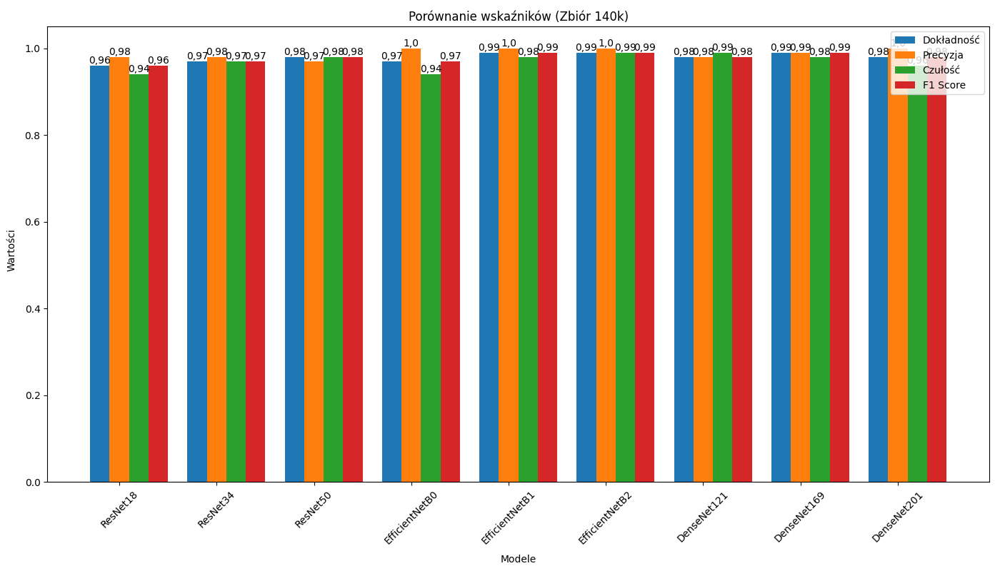
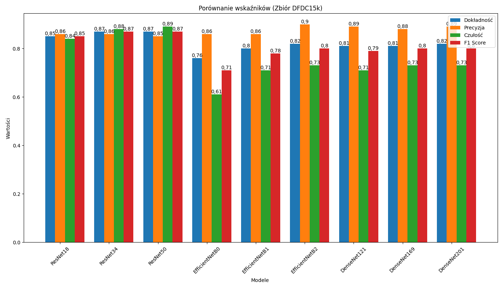
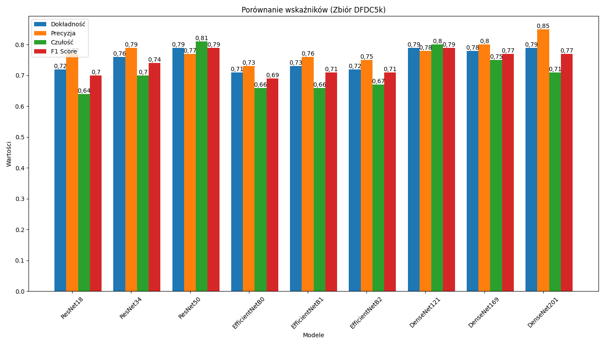

# An Experimental Study on the Effectiveness of Selected Deepfake Detection Methods. 

This project focuses on the analysis of the DeepFake phenomenon and the development of methods for visual DeepFake detection. The repository contains the experimental framework, model implementations, and evaluation pipeline developed as part of a master’s thesis.

The research is structured into several key stages, including dataset preparation, model implementation, training, and comparative evaluation.

## General Information

Experiments are conducted on multiple datasets of varying sizes, allowing for the analysis of how dataset scale and characteristics influence detection performance. Several detection models are implemented, and each model is evaluated in multiple configuration variants to enable a broader and more reliable comparison.

The main goals of this project are:

To compare the performance of different DeepFake detection models

To evaluate the impact of dataset size and configuration choices on model performance

To identify key factors influencing the robustness and accuracy of visual DeepFake detection

## Software / Tech Stack

- **Python 3.x** – main programming language  
- **PyTorch** – model implementation and training  
- **Torchvision** – pretrained architectures and dataset utilities  
- **Matplotlib** – visualization of training results  
- **psutil** – system resource monitoring  
- **CUDA-enabled GPU** – NVIDIA Tesla T4 on Google Colab

## Datasets

The project uses two main datasets for training and evaluating DeepFake detection models:

1. **Flickr + StyleGAN Dataset**
   - Total of 140,000 images: 70,000 real images from Flickr and 70,000 generated images from StyleGAN.
   - Original images are 256x256 pixels and were resized appropriately to match the input resolution of the selected models.
   - For experiments, the dataset was downsampled to **12,000 images** to reduce computational load while preserving balance between real and fake images.

2. **DFDC Dataset (DeepFake Detection Challenge)**
   - Original dataset consists of video recordings, from which frames were extracted for face detection.
   - Faces were detected using OpenCV's Haar Cascade classifier, and images were converted to grayscale to improve detection efficiency.
   - Due to dataset imbalance (majority of fake images), the initial subset was limited to **5,000 images** (balanced between real and fake).
   - In a second phase of experiments, the DFDC dataset was expanded to **15,000 images**:
     - Real images: 3 frames extracted from each video.
     - Fake images: 1 frame per generated video (as in the first subset).
   - This expansion allowed for comparison of model performance with respect to both dataset size and data quality.

> **Note:** For licensing and size reasons, raw datasets are not included in this repository.

## Models and Implementation

### Models
The project evaluates three main architectures, each tested in multiple variants:

- **ResNet** – 18, 34, 50 layers  
- **EfficientNet** – B0, B1, B2 variants  
- **DenseNet** – 121, 169, 201 layers  

### Data Augmentation
To improve generalization and model performance, the following augmentations were applied:

- Random rotation  
- Resizing to match input resolution required by each model  
- Random horizontal flip  
- Normalization of pixel values  

## Experimental Setup

### Experimental Parameters
All models were trained with the following settings:

- Number of epochs: 40  
- Learning rate: 0.0001  
- Batch size: 64  
- Loss function: Binary Cross Entropy (BCE)  
- Optimizer: Adam

## Results

During training and validation, the occurrence of overfitting varied depending on the configuration and dataset size. The smaller DFDC 5k dataset showed more noticeable discrepancies between training and validation results, indicating overfitting. To address this, the study was extended with a larger DFDC 15k dataset, which helped reduce overfitting, although it was not entirely eliminated. Increasing the training dataset size also led to the expected improvement in identification accuracy.

| Model          | Zbiór 140k [%] | DFDC 5k [%] | DFDC 15k [%] |
|----------------|----------------|-------------|--------------|
| ResNet18       | 96             | 72          | 85           |
| ResNet34       | 97             | 76          | 87           |
| ResNet50       | 98             | 79          | 87           |
| EfficientNetB0 | 97             | 71          | 76           |
| EfficientNetB1 | 99             | 73          | 80           |
| EfficientNetB2 | 99             | 72          | 82           |
| DenseNet121    | 98             | 79          | 81           |
| DenseNet169    | 99             | 78          | 81           |
| DenseNet201    | 98             | 79          | 82           |

Table 1. Accuracy results

Summary of the results from the test datasets is presented using basic metrics describing the models’ behavior, with accuracy highlighted for each variant in the Table 1.

The 140k dataset exhibited very high metrics, hovering around 98%, which makes it difficult to distinguish between the different methods.

The DFDC datasets, in the 5k and 15k versions, show greater differences, allowing meaningful conclusions to be drawn. For both datasets, the worst accuracy was achieved by EfficientNet.

For the smaller dataset, DenseNet achieved the best results. However, with an increased dataset size, ResNet takes the lead. Across all models, there is a clear trend: as the number of layers and model complexity increases, accuracy improves.

### Note

All charts below contain original labels in Polish. English translations are provided in the table for clarity.

| Polish label   | English translation |
|----------------|------------------|
| Dokładność     | Accuracy         |
| Czułość        | Recall           |
| Precyzja       | Precision        |
| Liczba próbek  | Number of samples |

Table 2. Charts translation.
> These translations apply to all subsequent charts.

<em>Figure 1: Metrics results for the first dataset.</em>

<em>Figure 2: Metrics results for the second dataset.</em>

<em>Figure 3: Metrics results for the second dataset (increased number of samples).</em>

The models achieved very high performance on the 140k dataset, indicating they classify the data they were trained on very accurately. High precision suggests few false positives, while high recall indicates effective detection of positive cases.

However, on the more complex DFDC datasets (5k and 15k), both precision and recall decrease. Lower precision means a higher chance of false positives, while lower recall indicates some positive cases may be missed—critical for deepfake detection. This performance drop shows that models, though excellent on familiar data, may struggle to generalize to more diverse and challenging cases.

## Summary / Conclusions
The selected datasets differed significantly. The 140k dataset contained high-quality images with well-generated deepfakes, while the DFDC dataset consisted of extracted video frames of varying quality, making detection more challenging.

Models were trained and validated on the 140k and DFDC (5k) datasets. Due to concerns with the smaller DFDC set, it was expanded to 15k samples, resulting in improved metrics. EfficientNet models consistently showed the lowest performance, whereas ResNet and DenseNet dominated, with the leading model depending on the dataset.

Overall, models performed nearly perfectly on the 140k dataset, while the DFDC dataset proved more difficult due to lower resolution and variability in deepfake techniques. These results highlight that although current detection methods are highly effective, diverse and lower-quality data still pose challenges, emphasizing the need for robust detection tools to address real-world deepfakes.

## Authors
- Daniel Swyst

